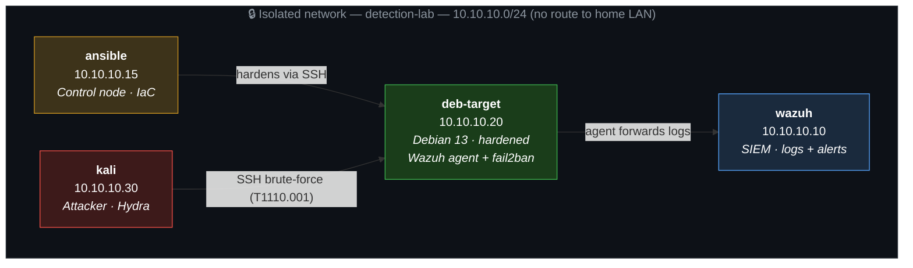

# Detection & Response Lab
Blue-team home lab: harden a Linux server with Ansible, attack it from a Kali machine, and detect and stop the attack with fail2ban + Wazuh (SIEM).

## Architecture
Isolated Proxmox network (`detection-lab`), no home-LAN access (NAT only for updates). Four VMs:

- **ansible** — control node, runs the hardening playbook against the target.
- **deb-target** — hardened Debian 13 server, monitored, runs the Wazuh agent.
- **wazuh** — SIEM, collects logs and raises alerts.
- **kali** — attacker.



## Hardening (Ansible)
Target hardened with an Ansible playbook (repeatable, version-controlled):
- SSH: no root login, `MaxAuthTries 3`, no empty passwords, no X11/TCP/agent forwarding, verbose logging.
- Firewall (ufw): default-deny, only SSH + Wazuh ports open.
- Tooling: fail2ban, Lynis, rkhunter, debsums.
- Policies: password expiration, login banners, telnet removed.

**Lynis hardening index: 68 → 77.**

## Attack & Detection
- **Attack:** automated SSH brute-force with Hydra (MITRE ATT&CK T1110.001).
- **Prevention:** fail2ban detected the burst and banned the attacker in ~2s, before the valid password was reached.
- **Detection:** Wazuh fired rule 5503 (per-attempt) and correlation rule 5551 (level 10).
- **Forensics:** 821-packet PCAP in Wireshark — 40% TCP retransmissions (the ban), `libssh` banner + 0.38s connections (automated-traffic signature).

The hardening is what stopped the attack — defense and attack are two halves of the same story.

## Results
| Metric | Value |
|--------|-------|
| Lynis index | 68 → 77 |
| Technique | T1110.001 (Password Guessing) |
| Detection | Wazuh rules 5503 + 5551 |
| Response | fail2ban auto-ban (~2s) |
| Outcome | Blocked, no compromise |

## Structure
```
ansible/       Hardening playbook (Infrastructure as Code)
evidence/      pcaps · scans · screenshots
reports/       Incident report (PDF)
lab-journal.md Daily lab notes
```

## Docs
- Incident report: `reports/incident-report.pdf`
- Hardening playbook: `ansible/hardening_pb.yml`
- Lab journal: `lab-journal.md`

## Stack
Proxmox · Debian · Kali · Ansible · Wazuh · fail2ban · ufw · Lynis · Hydra · tcpdump · Wireshark
